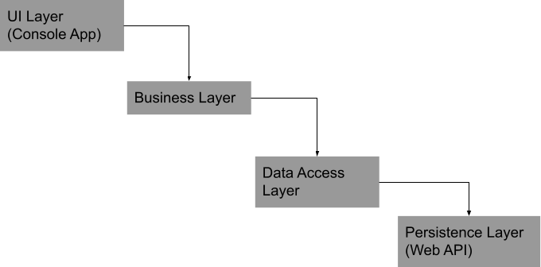

# CleanCode-Demo
My awesome monolith application. 

## Project Structure
The application has 4 layers. 
* 1 UI Layer - A console application which provides options to list, clear and refresh a list of people. 
* 2 Business Layer - The business layer (BL) exposes methods that the UI layer can make use of to list, clear and refresh list of people. The business layer contains details as to how to retrieve data and return it to the UI layer. 
* 3 Data Access Layer - This layer contains information about where to retrieve data from. It contains methods that the BL can utilize to fetch data for processing. 
* 4 Persistence Layer - This is the layer where the data resides. In the application, this is a web service that contains 2 endpoints. 
`/api/people`
to get the list of people and 
`/api/people/{id}`
to get the person by id.
  
  Apart from this, there is also a Shared project that contains Domain objects and any common items that may be used by multiple projects.
  

## Running the application
* From the solution explorer, open '04. Persistence' folder. 
* Right click on 'WebService project' and select 'Open Folder in File Explorer' from the context menu. 
* In the address bar of the explorer window, type in cmd to launch command prompt and automatically navigate to that folder.
* Once in command prompt, type in `dotnet run`. This will launch the web service. 
* Once the web service is running, you can set the 'UI' project under '01. UI' folder as the start up project, build the solution and run it. 
